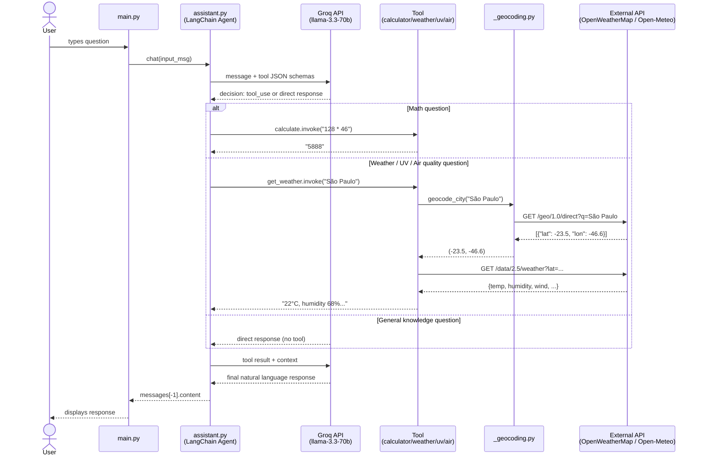

# 🤖 AI Assistant — Intelligent Agent with Tool Calling

> An AI assistant that autonomously decides when to answer from its own knowledge and when to invoke external tools — calculator, weather forecast, UV index, and air quality — using native Function Calling via LangChain + Groq.

---

## 📋 Table of Contents

- [Solution Demo](#-solution-demo)
- [Architecture](#-architecture)
- [Project Structure](#-project-structure)
- [Tech Stack](#-tech-stack)
- [Prerequisites](#-prerequisites)
- [Environment Setup](#-environment-setup)
- [How to Run](#-how-to-run)
- [Implementation Logic](#-implementation-logic)
- [Technical Decisions](#-technical-decisions)
- [AI Model Used](#-ai-model-used)
- [Security](#-security)
- [Future Improvements](#-future-improvements)
- [Learnings](#-learnings)
- [Final Remarks](#-final-remarks)

---

## 🎬 Solution Demo

The assistant receives any natural language question via CLI and autonomously decides whether to answer directly or invoke an external tool.

```
You: How much is 128 times 46?
Assistant: 128 × 46 = 5888

You: What's the weather like in São Paulo?
Assistant: In São Paulo the temperature is 22°C, feels like 20°C, humidity 68%, wind 15 km/h.

You: What is the UV index in Fortaleza right now?
Assistant: The UV index in Fortaleza is 9 (Very High). Apply SPF 50+ sunscreen.

You: Who was Albert Einstein?
Assistant: Albert Einstein was a German theoretical physicist, known for the theory of relativity...

You: What is the air quality in Beijing?
Assistant: The air quality index in Beijing is 156 (Unhealthy). Avoid outdoor activities.
```

**Main flow:**

```
User types a question
        │
        ▼
   LangChain Agent (ReAct)
        │
   ┌────┴─────────────────────────────────────┐
   │ Groq llama-3.3-70b analyses the intent   │
   └────┬─────────────────────────────────────┘
        │
   ┌────▼────────────────────────────────────────────────────────┐
   │ Math?        → calculate()                                  │
   │ Weather?     → get_weather()    ──► OpenWeatherMap API      │
   │ UV index?    → get_uv_index()   ──► Open-Meteo API          │
   │ Air quality? → get_air_quality() ──► OpenWeatherMap API     │
   │ Other?       → direct model response                        │
   └────┬────────────────────────────────────────────────────────┘
        │
        ▼
   Natural language response
```

---

## 🏗 Architecture

The solution adopts a **ReAct agent** architecture (Reason → Act → Observe): the model reasons about the question, decides whether to invoke a tool, observes the result, and formulates the final response — with no if/else classification logic in the code.

### Architecture Diagram

```mermaid
flowchart TD
    User(["👤 User\nCLI"])

    subgraph App["🐍 Python Application"]
        direction TB
        Main["main.py\nCLI Loop"]
        Agent["assistant.py\nLangChain Agent\ncreate_agent + ChatGroq"]
        Config["config.py\npython-dotenv\nEnvironment Variables"]

        subgraph Tools["🛠 Tools — src/tools/"]
            Calc["calculator.py\nsafe_eval via AST"]
            Weather["weather.py\nget_weather()"]
            UV["uv_index.py\nget_uv_index()"]
            AQ["air_quality.py\nget_air_quality()"]
            Geo["_geocoding.py\ngeocode_city()\n[shared module]"]
        end
    end

    subgraph External["🌐 External Services"]
        Groq["☁️ Groq API\nllama-3.3-70b-versatile\nFunction Calling / LPU"]
        OWM["🌤 OpenWeatherMap API\nWeather + Air Quality"]
        OM["🌞 Open-Meteo API\nUV Index — free, no key"]
    end

    subgraph Tests["🧪 Tests — pytest"]
        TC["test_calculator.py\n12 unit & integration\ntests"]
        TW["test_weather.py\n4 tests with\nunittest.mock"]
        CF["conftest.py\npath configuration"]
    end

    Env[".env\nGROQ_API_KEY\nOPENWEATHER_API_KEY\nGROQ_MODEL"]

    User -->|question| Main
    Main -->|chat()| Agent
    Agent <-->|LLM inference\nFunction Calling| Groq
    Agent -->|invokes tool| Calc
    Agent -->|invokes tool| Weather
    Agent -->|invokes tool| UV
    Agent -->|invokes tool| AQ
    Weather --> Geo
    UV --> Geo
    AQ --> Geo
    Geo -->|geocoding| OWM
    Weather -->|weather data| OWM
    AQ -->|air data| OWM
    UV -->|UV data| OM
    Config -->|loads| Env
    Config --> Agent
    Agent -->|response| Main
    Main -->|displays| User

    Tests -.->|tests| Calc
    Tests -.->|tests with mock| Geo
```

### Full Data Flow Diagram



---

## 📁 Project Structure

```
ai-assistant/
│
├── main.py                     # Entry point — interactive CLI loop
│
├── src/
│   ├── __init__.py
│   ├── assistant.py            # LangChain agent: tool registration, ChatGroq, create_agent
│   ├── config.py               # Environment variable loading via python-dotenv
│   │
│   └── tools/
│       ├── __init__.py
│       ├── calculator.py       # Tool: safe_eval() via AST + @tool calculate
│       ├── weather.py          # Tool: current weather (OpenWeatherMap)
│       ├── uv_index.py         # Tool: UV index (Open-Meteo — free API)
│       ├── air_quality.py      # Tool: air quality index (OpenWeatherMap)
│       └── _geocoding.py       # Shared module: geocode_city() — converts name → (lat, lon)
│
├── tests/
│   ├── conftest.py             # sys.path setup so pytest finds src/
│   ├── test_calculator.py      # 12 tests: safe_eval + calculate.invoke
│   └── test_weather.py         # 4 tests with unittest.mock (HTTP mocks for geocoding)
│
├── .env.example                # Environment variable template (no real values)
├── .gitignore                  # Excludes .env, .venv, __pycache__, .pytest_cache
├── requirements.txt            # Project dependencies
└── README.md                   # This documentation
```

### File Responsibilities

| File | Responsibility |
|---|---|
| `main.py` | CLI loop: reads input, calls `chat()`, displays response, handles EOF/KeyboardInterrupt |
| `assistant.py` | Registers the 4 tools, instantiates `ChatGroq`, creates the agent with an explicit system prompt |
| `config.py` | Centralises `.env` reading — single source of truth for credentials |
| `calculator.py` | Evaluates math expressions with `ast.parse()` + operator whitelist |
| `weather.py` | Converts city name to coordinates and queries current weather from OpenWeatherMap |
| `uv_index.py` | Queries UV index via Open-Meteo (the `/uvi` endpoint was discontinued on OWM's free plan) |
| `air_quality.py` | Queries the Air Quality Index (AQI) via OpenWeatherMap Air Pollution API |
| `_geocoding.py` | Converts city name to `(lat, lon)` — reused by weather, UV and air quality tools (DRY) |
| `conftest.py` | `sys.path.insert(0, ...)` so pytest locates `src/` without installing the package |
| `test_calculator.py` | Tests `safe_eval` (operations, edge cases, blocked expressions) and `calculate.invoke` |
| `test_weather.py` | Tests `geocode_city` with HTTP mocks: success, city not found, 401, Timeout |

---

## 🛠 Tech Stack

| Technology | Version | Purpose | Why it was chosen |
|---|---|---|---|
| **Python** | 3.14 | Main language | Mature ecosystem for LLMs and data |
| **LangChain** | ≥ 0.2.0 | ReAct agent orchestration | Handles state management, retry, and tool calling without reinventing the wheel |
| **LangChain-Core** | ≥ 0.2.0 | `@tool` decorator, typing | Standard interface for registering tools as JSON schemas |
| **LangChain-Groq** | ≥ 0.1.0 | Groq API integration | Official connector — 3-line setup |
| **Groq API** | — | LLM inference | Ultra-low latency via LPU; generous free tier for development |
| **llama-3.3-70b-versatile** | — | Language model | Best Function Calling support among models tested; reliable reasoning |
| **OpenWeatherMap API** | 2.5 | Weather + air quality | Well-documented REST API; free plan covers geocoding + weather + AQI |
| **Open-Meteo API** | — | UV index | 100% free, no API key; replaces the discontinued `/uvi` endpoint on OWM |
| **python-dotenv** | ≥ 1.0.0 | Secret management | Industry standard for loading `.env` without exposing credentials |
| **requests** | ≥ 2.31.0 | HTTP calls to external APIs | Mature library with timeout and HTTP error handling |
| **pytest** | ≥ 8.0.0 | Testing framework | Simple, powerful, native integration with `unittest.mock` |
| **unittest.mock** | stdlib | HTTP call mocking | Tests business logic without internet access or API quota consumption |

---

## ✅ Prerequisites

- **Python 3.11+** (developed and tested on Python 3.14)
- **pip** or **uv** for package management
- **Git**
- Free account on [Groq Console](https://console.groq.com/) to obtain `GROQ_API_KEY`
- Free account on [OpenWeatherMap](https://openweathermap.org/api) to obtain `OPENWEATHER_API_KEY`

> **Open-Meteo** requires no sign-up and no API key.

---

## ⚙️ Environment Setup

### 1. Clone the repository

```bash
git clone https://github.com/your-username/ai-assistant.git
cd ai-assistant
```

### 2. Create and activate a virtual environment

```bash
# Create
python -m venv .venv

# Activate — Linux/macOS
source .venv/bin/activate

# Activate — Windows
.venv\Scripts\activate
```

### 3. Install dependencies

```bash
pip install -r requirements.txt
```

### 4. Configure environment variables

Copy the example file and fill in your keys:

```bash
cp .env.example .env
```

Edit the `.env` file:

```env
# Groq — https://console.groq.com/keys
GROQ_API_KEY=your_groq_key_here

# Groq model (recommended default for Function Calling)
GROQ_MODEL=llama-3.3-70b-versatile

# OpenWeatherMap — https://home.openweathermap.org/api_keys
OPENWEATHER_API_KEY=your_openweather_key_here
```

> ⚠️ **Never commit the `.env` file with real values.** The `.gitignore` already excludes it.

### Where to get the keys

| Service | URL | Plan required |
|---|---|---|
| Groq API | https://console.groq.com/keys | Free |
| OpenWeatherMap | https://home.openweathermap.org/api_keys | Free (One Call 3.0 is not needed) |
| Open-Meteo | — | No key — free and no sign-up required |

---

## ▶️ How to Run

### Run the assistant

```bash
python main.py
```

You will see:

```
Welcome to the assistant! Type your question or 'exit' to quit.
==================================================
Example questions:
 - What is 128 times 46?
 - Who was Albert Einstein?
 - How is the weather in São Paulo?
 - What is the UV index in Rio de Janeiro?
 - What is the air quality in Beijing?
 - What is the square root of 1024?
Type 'exit' to quit.

You:
```

### Run the tests

```bash
# All tests
pytest

# Verbose output
pytest -v

# Calculator tests only
pytest tests/test_calculator.py -v

# Geocoding/weather tests only
pytest tests/test_weather.py -v

# With coverage (requires pytest-cov)
pip install pytest-cov
pytest --cov=src tests/
```

### Verify installation

```bash
# Confirm Python version
python --version

# List installed dependencies
pip list | grep -E "langchain|groq|requests|pytest"
```

---

## 🧠 Implementation Logic

### How the requirements were met

| Requirement | Implementation |
|---|---|
| Identify if a question is mathematical | Delegated to the model via Function Calling — no regex, no if/else |
| Use a calculator for computations | `@tool calculate` with `safe_eval()` via AST — never raw `eval()` |
| Answer directly for non-math questions | The model chooses not to invoke any tool and responds from its own knowledge |
| Additional superpowers | +3 tools: weather, UV index, and air quality — all via public APIs |

### Detailed data flow

```
1. User types question → main.py captures with input()
2. main.py calls chat(input_msg)
3. assistant.py sends to the LangChain agent
4. LangChain serialises the JSON schemas of all 4 tools
5. Groq (llama-3.3-70b) analyses: direct response or tool_call?
6a. If tool_call → LangChain invokes the corresponding Python function
6b. Tool executes (local calculation or HTTP call)
6c. Result is returned as a string to the agent
7. Groq receives the result and formulates the final response
8. assistant.py extracts messages[-1].content
9. main.py displays "Assistant: <response>"
```

### Key architectural decisions

**Function Calling vs. manual classification:**
The naive approach would be to detect math questions with regex (`r"\d+\s*[\+\-\*\/]\s*\d+"`). The problem: phrases like *"what is half of 200?"* or *"how many days are in 3 weeks?"* escape any regex. With Function Calling, the model understands semantic intent — not syntactic form — and decides when to invoke the calculator. This scales to any number of tools without touching the routing logic.

**`_geocoding.py` as a shared module:**
Three tools needed to convert a city name to coordinates. Extracting `geocode_city()` into a separate module avoids code duplication (DRY principle) and allows geocoding to be tested in isolation, with HTTP mocks, without any internet dependency.

**`safe_eval()` with an AST whitelist:**
`eval("__import__('os').system('rm -rf /')")` is a real attack vector. The implementation uses `ast.parse()` to build the expression's AST and walks the nodes, accepting only explicitly listed arithmetic operations (`Add`, `Sub`, `Mul`, `Div`, `Pow`, `Mod`, `UAdd`, `USub`). Any other node raises a `ValueError`. Principle of least privilege applied to the calculator.

**Open-Meteo for UV index:**
The `/uvi` endpoint on OpenWeatherMap was discontinued on the free plan. Rather than asking the user to pay, the solution found Open-Meteo — a public, free, key-less API — which exposes `current.uv_index`. The tool became more robust and cost-free.

### Trade-offs

| Decision | Advantage | Limitation |
|---|---|---|
| Groq + Llama 70b | Low latency, free tier | Rate limit on free plan; model may change |
| LangChain `create_agent` | State management out-of-the-box | Abstraction adds versioning overhead |
| CLI instead of REST API | Simple to run, no frontend needed | Cannot be consumed by other systems |
| Stateless agent | No memory complexity | Each question is independent — no context between turns |
| Tools always return strings | Agent never receives an exception | API errors are silent to the end user |

---

## 🔧 Technical Decisions

### Framework choice

**LangChain** was chosen over building the ReAct loop manually because:
- It manages the Reason → Act → Observe cycle internally (via LangGraph)
- It serialises tool JSON schemas automatically from docstrings and type hints
- It handles retry and `tool_calls` parsing without boilerplate code
- It is the most widely adopted framework in AI Engineering — familiarity is a valued skill

### AI integration strategy

The agent uses the **ReAct** pattern (Reason, Act, Observe):
1. The model receives the question + JSON schemas of all available tools
2. It reasons about which tool (if any) resolves the question
3. It acts by calling the tool with the correct arguments
4. It observes the returned result
5. It decides whether to act again or formulate the final response

This pattern ensures that numerical answers are always computed — never hallucinated.

### Error handling strategy

Each tool implements defensive handling in three layers:

```python
# Layer 1: HTTP Timeout
except requests.exceptions.Timeout:
    return "Error: request timed out."

# Layer 2: HTTP errors (401, 404, 500...)
except requests.exceptions.RequestException as e:
    return f"Error: {e}"

# Layer 3: Missing data in the response
if not data:
    return "Error: city not found."
```

A tool **never raises an exception to the agent** — it always returns a string, even on failure. This prevents an external service outage from bringing down the entire execution chain.

---

## 🤖 AI Model Used

### `llama-3.3-70b-versatile` via Groq

| Attribute | Detail |
|---|---|
| **Provider** | Meta (model) + Groq (inference via LPU) |
| **Parameters** | 70 billion |
| **Context window** | 128k tokens |
| **Strengths** | Instruction following, function calling, reasoning |

### Why this model was chosen

During development, `llama3-8b-8192` was tested first (lower cost, higher speed). It failed consistently at Function Calling: it returned `tool_use_failed` with malformed arguments — the JSON schema was ignored. Migrating to `llama-3.3-70b-versatile` solved the problem completely. The lesson: **instruction following capability scales with model size**.

Groq was preferred over OpenAI because:
- Extremely low latency via LPU (Language Processing Unit) — noticeable in an interactive CLI
- Free plan sufficient for development and testing
- Llama is open-weight — no single-vendor lock-in

### Identified limitations

- **Free plan rate limit:** ~30 req/min — sufficient for development, restrictive in production with multiple users
- **Stateless by nature:** no memory between turns — follow-up questions ("what about that same city?") lose context
- **Non-determinism:** vague system prompts produce inconsistent behaviour — precise prompts are part of the code

### Viable alternatives

| Model | Advantage | Disadvantage |
|---|---|---|
| `gpt-4o-mini` (OpenAI) | Best-in-class function calling | Cost per token |
| `claude-haiku-4-5` (Anthropic) | Fast, affordable | Paid API |
| `mistral-7b` (local via Ollama) | Zero cost, privacy | Weaker function calling |
| `gemma-2-9b-it` (Groq) | Free, fast | Lower function calling accuracy than 70b |

---

## 🔒 Security

### Environment variables

All API keys are loaded exclusively via `python-dotenv` from the `.env` file:

```python
# config.py
load_dotenv()
GROQ_API_KEY: str = os.environ["GROQ_API_KEY"]           # KeyError if absent
OPENWEATHER_API_KEY: str = os.environ["OPENWEATHER_API_KEY"]
```

Using `os.environ["KEY"]` (instead of `os.getenv("KEY")`) ensures fast and explicit failure if a variable is not configured — preventing silent execution without credentials.

### Secret protection

```gitignore
.env
.venv/
__pycache__/
.pytest_cache/
```

The `.gitignore` excludes `.env` from version control. The repository contains only `.env.example` with placeholder values — no real secrets.

### Input validation — calculator

User input is **never executed as Python code**. The calculator's security pipeline:

```
user input
      │
ast.parse(expr, mode="eval")   ← builds AST without executing
      │
walks AST nodes
      │
whitelist: [Add, Sub, Mul, Div, Pow, Mod, Num, UnaryOp]
      │
any other node → ValueError    ← blocks __import__, open(), etc.
      │
eval() only on whitelisted nodes  ← never eval() on the raw string
```

### Security best practices adopted

- `os.environ["KEY"]` — explicit failure if variable is absent
- `safe_eval()` with AST whitelist — eliminates code injection vector
- HTTP timeout on every external call — prevents indefinite hangs
- Tools always return `str` — errors do not propagate as exceptions
- Credentials separated by service — independent key rotation

---

## 🚀 Future Improvements

### Short term

- **Structured logging** — replace `print()` with the `logging` module with environment-configurable levels (`DEBUG` in dev, `INFO` in prod). Current logs go to stdout with no structure — impossible to filter or export to an observability system.

- **Retry with exponential backoff** — implement with [Tenacity](https://tenacity.readthedocs.io/) to handle `429 Too Many Requests` and `503 Service Unavailable` from external APIs with increasing wait intervals.

- **Integration test fixtures** — expand `conftest.py` with fixtures for weather/UV/air quality tools, increasing coverage beyond geocoding.

### Medium term

- **Conversation memory** — implement `ConversationBufferMemory` to maintain history across turns. This would allow questions like *"what about the UV index in that same city?"* without repeating the name.

- **Results cache with TTL** — weather and UV do not change every second. A simple timestamp-based cache would eliminate redundant calls. Minimal implementation: `dict` with a 10-minute TTL. In production: Redis.

- **Model benchmarking** — the model choice was empirical. In production, a standardised test suite would measure function calling success rate, p95 latency, and cost per query for each candidate model.

### Long term

- **REST API with FastAPI** — exposing the agent as a `POST /chat` endpoint would allow any frontend to consume it. The FastAPI experience from the RAG project applies directly.

- **Observability with LangSmith** — automatically trace which tools were called, with which arguments, how many tokens were consumed, and where the agent failed. Essential in production.

- **Multi-agent architecture with LangGraph** — with many tools, the 70b model makes more routing errors. A router agent that delegates to specialised sub-agents (Math Agent, Weather Agent, etc.) solves the scaling problem.

- **Web interface (Streamlit or Next.js)** — CLI is a barrier for non-technical users. A chat interface removes that friction entirely.

---

## 📚 Learnings

### What was learned during development

**Model choice matters as much as architecture.** The same code, with the same tool structure, failed with `llama3-8b-8192` and worked correctly with `llama-3.3-70b-versatile`. The ability to follow instructions and respect JSON schemas is not uniform across models — it is a quality dimension that must be tested empirically, not assumed.

**System prompts are code — not documentation.** Vague prompts produce unpredictable behaviour. The final system prompt includes explicit instructions like *"ALWAYS use the calculate tool for any arithmetic — never compute math yourself"* because without that instruction the model would occasionally answer simple calculations from memory. This directly echoes what I learned in requirements elicitation during undergrad research: clarity of intent eliminates ambiguity of implementation.

**Shared modules emerge naturally from the code, not from upfront planning.** `_geocoding.py` was not in the initial design. When implementing the third tool that needed geographic coordinates, the duplication became obvious and the extraction was natural. DRY is not a memorised rule — it is a signal the code emits when it is ready to be refactored.

**Free API constraints are part of the engineering context.** The `/uvi` endpoint on OpenWeatherMap was discontinued on the free plan — the documentation did not make this clear. Discovering it via a direct browser test (not via a code error) was the right approach: isolate the problem at the simplest possible layer before assuming it is a bug in the code.

### Main challenges and how they were resolved

| Challenge | Root cause | Solution |
|---|---|---|
| Model did not invoke tools | `llama3-8b-8192` had weak function calling support | Migrated to `llama-3.3-70b-versatile` + more explicit system prompt |
| UV endpoint returned errors | `/uvi` discontinued on OWM free plan | Migrated to Open-Meteo (free, no key required) |
| Tests could not find `src/` | `pytest` does not add project root to path automatically | `conftest.py` with `sys.path.insert(0, ...)` |
| `eval()` as an attack surface | User input executed as Python code | `safe_eval()` with AST whitelist — never `eval()` on the raw string |

### What would be done differently in a next version

1. **Start with the larger model** — testing the 70b from the beginning would have avoided the debug cycle with the 8b model.

2. **Tests before integration** — writing tool tests before connecting them to the agent would validate each component independently, speeding up debugging.

3. **Logging from day one** — `print()` was sufficient for development, but structured `logging` would replace it from the first line in any project heading to production.

4. **`.env.example` as a contract** — documenting all required variables in `.env.example` before writing any code ensures nothing is forgotten at delivery time.

---

## 🏁 Final Remarks

This project goes beyond the requested MVP — an assistant with a calculator — without incurring unnecessary complexity. The decision to use native Function Calling instead of regex classification was not aesthetic: it is the approach that scales. With regex, every new intent requires a new rule. With Function Calling, every new tool is simply registered — the model learns to use it from the schema and the docstring.

The extraction of `_geocoding.py`, the HTTP mocks in the weather tests, and the AST-based `safe_eval()` are not implementation details — they are evidence of an engineering process: every decision has a traceable technical justification, not a personal preference.

The biggest learning was not technical: it was realising that in LLM-based systems, model behaviour in production is as much a part of the architecture as the database choice. Testing empirically, documenting what was found, and building safeguards — `safe_eval`, error strings, precise system prompts — is what separates a prototype from a reliable system.

---

<div align="center">

**Maria Victoria Soares Fiori**

Software Engineering · UFC | M.Sc. Computer Science · UNICAMP

[](https://github.com/mavifiori/Backlogs-data-ReBI0s-)

</div>